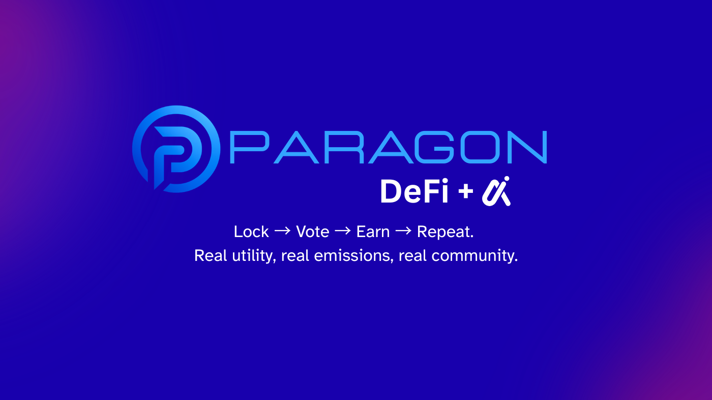
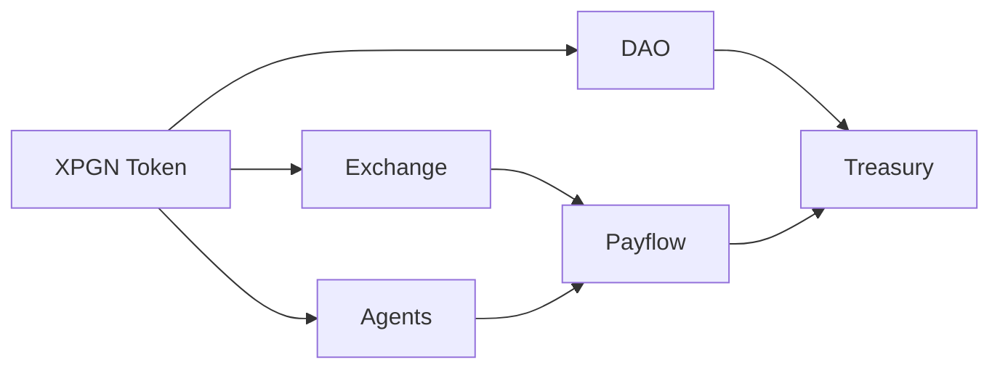

# ParagonChain Protocol Contracts

<div align="center">




**The source-of-truth contracts repository for ParagonChain protocol systems approved for the organization workspace.**

This repository is intentionally separate from audit workspaces, internal research branches, and unreleased experiments. It is the public-facing protocol codebase for the live ParagonChain stack.

[Protocol Surface](#protocol-surface) • [Live Contracts](#live-contracts-and-deployments) • [Architecture](#architecture-at-a-glance) • [Getting Started](#getting-started) • [Module Docs](#module-documentation) • [Security](#security-and-release-posture)

</div>

## What This Repository Is

ParagonChain is organized as a multi-product protocol stack rather than a single contract package. This repository brings those systems together in one clean development surface so contributors, reviewers, integrators, and future auditors can understand the protocol as a whole.

It is built around five principles:

- clear boundaries between protocol products
- readable contract organization by domain
- disciplined separation from audit and R&D repositories
- reproducible local development and testing
- documentation that explains both **what** each module does and **why** it exists

## Protocol Surface

| Module | Purpose | Why It Exists |
| --- | --- | --- |
| [`exchange/`](./contracts/exchange) | AMM primitives, pair/factory model, router paths, oracle-aware swap rails, and liquidity helpers. | Forms the trading and liquidity backbone of ParagonChain. |
| [`payflow/`](./contracts/payflow) | Intent execution, relayer settlement, rebate routing, fee accounting, and surplus-aware swap handling. | Supports programmable payment and execution flows beyond standard swaps. |
| [`dao/`](./contracts/dao) | Governance, voting escrow, emissions, gauges, fee distribution, and protocol incentive systems. | Aligns long-term governance, liquidity incentives, and protocol ownership. |
| [`agents/`](./contracts/agents) | Agent registry, execution permissions, signed-intent controls, and commercial agent rails. | Opens the protocol to agent-native products without weakening core execution controls. |
| [`treasury/`](./contracts/treasury) | Treasury-facing reward routing, custody-adjacent distribution, and controlled protocol value flows. | Keeps treasury operations explicit, reviewable, and separate from user-facing logic. |
| [`XpgnToken/`](./contracts/XpgnToken) | Shared protocol token infrastructure. | Supports both liquidity and governance layers across the stack. |
| [`mocks/`](./contracts/mocks) | Test-only mocks and local verification helpers. | Makes local development faster without mixing non-production contracts into core modules. |

## Live Contracts And Deployments

Clear deployment visibility is part of a professional protocol repository. This repo is intended to show not only the source code, but also the approved live contract surface for users, integrators, and reviewers.

Use the deployment registry in [`deployments/`](./deployments) to publish:

- canonical mainnet contract addresses
- deployment status by module
- verification links when available
- the contract name that maps to each live address
- notes about whether a contract is active, legacy, paused, or pending migration

Current registry files:

- [Deployments Overview](./deployments/README.md)
- [Mainnet Registry](./deployments/MAINNET.md)

If a contract is live, it should be discoverable here through a clean published address registry rather than requiring users to search through scripts or announcements.

## Why The Repo Is Structured This Way

Top protocols are easy to navigate because each contract family has a clear home and a clear story. ParagonChain follows the same standard:

- `exchange` owns liquidity and swap infrastructure
- `payflow` owns programmable execution and settlement logic
- `dao` owns governance and incentive systems
- `agents` owns permissioned autonomous execution rails
- `treasury` owns controlled protocol value distribution
- shared protocol dependencies stay separate when they serve more than one product line

This keeps the repository professional for contributors and safer for production work. It also makes future audits easier to scope because product areas are already separated by responsibility.

## Architecture At A Glance



## Repository Layout

```text
contracts/
  exchange/     AMM, router, pairs, factories, oracle-aware swap infrastructure
  payflow/      intent execution, rebates, relayers, settlement logic
  dao/          governance, ve mechanics, gauges, emissions, fee distribution
  agents/       agent registry, executor policy, monetization primitives
  treasury/     treasury distribution and reward routing components
  XpgnToken/    protocol token contracts
  mocks/        local test-only support contracts
test/           local and focused regression coverage
docs/           repo scope, architecture, security, and workflow notes
deployments/    approved deployment outputs and live contract registries
```

## Getting Started

### Requirements

- Node.js 20+
- npm 10+
- a local `.env` when deployment or network-specific scripts require it

### Install

```bash
npm install
```

### Compile

```bash
npm run compile
```

### Run Local Tests

```bash
npm run test:local
```

### Run Focused Module Suites

```bash
npm run test:exchange
npm run test:payflow
npm run test:agents
```

### Load A Specific Environment File

```powershell
$env:DEPLOY_ENV_FILE=".env.example"
npm run compile
```

## Development Standards

- Only include contracts that are approved for this repository.
- Keep audit snapshots and sensitive review material outside this repo.
- Do not commit secrets, keys, or privileged operational shortcuts.
- Treat `contracts/mocks/` as non-production code.
- Keep product boundaries clear when introducing new contracts or scripts.
- Document admin, treasury, relayer, pauser, and minting powers before release.

## Security And Release Posture

This repository is meant to be the clean protocol codebase, not the place where every idea lives.

- Audit workspaces remain separate.
- Internal R&D should remain private until intentionally promoted.
- Deployment outputs should only be committed if they are safe for publication.
- Reviewed or audited release points should be tagged explicitly.
- Public documentation should stay aligned with the actual contract surface.

For deeper policy details, see:

- [Repository Scope](./docs/REPO_SCOPE.md)
- [Architecture Overview](./docs/ARCHITECTURE.md)
- [Security Notes](./docs/SECURITY.md)

## Module Documentation

Each protocol domain has its own README so the repository stays understandable as it grows:

- [Exchange Module](./contracts/exchange/README.md)
- [Payflow Module](./contracts/payflow/README.md)
- [DAO Module](./contracts/dao/README.md)
- [Agents Module](./contracts/agents/README.md)
- [Treasury Module](./contracts/treasury/README.md)
- [XPGN Token Module](./contracts/XpgnToken/README.md)
- [Mocks And Test Utilities](./contracts/mocks/README.md)
- [Testing Guide](./test/README.md)

## Intended Audience

This repository is designed for:

- protocol contributors
- smart contract reviewers and auditors
- infrastructure and DevOps operators
- integration partners
- researchers evaluating ParagonChain architecture

## Scope Boundary

This repository should contain:

- approved live or near-live protocol contracts
- safe-to-publish deployment artifacts
- documentation required to understand the released surface

This repository should not contain:

- frozen CertiK audit workspaces
- internal audit notes
- unreleased strategy contracts
- experimental product concepts
- secrets or private operational data
- deployment or operational scripts that are not meant for public release

## Licensing

Licensing in this repository is **module-specific**, not repository-wide.

- `payflow` contracts may use `BUSL-1.1` where specified.
- Other modules may use different licenses as declared in their source files.
- Always treat the SPDX identifier in each contract file as the authoritative license reference.
