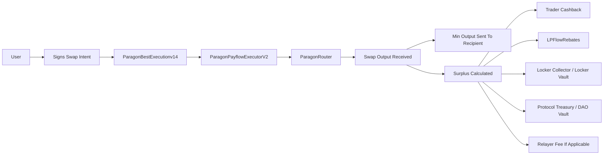
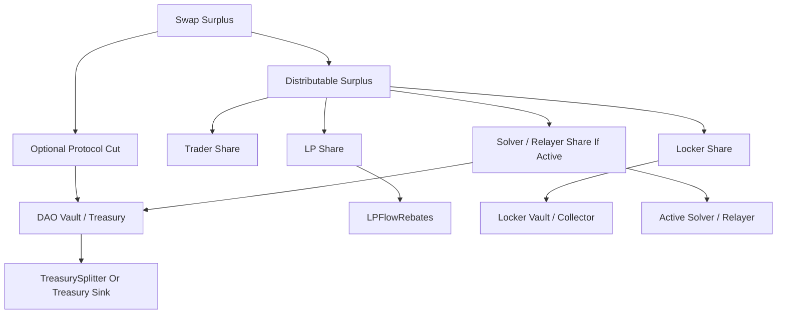

# Payflow

The Payflow module is ParagonChain's programmable execution and settlement layer for routed swap intents.

It sits between a signed user intent and the final value distribution across the trader, LP rebate system, locker incentives, protocol treasury, and relayer rails.

## What Payflow Does

Payflow extends normal AMM routing into a higher-level execution system.

It is responsible for:

- verifying and consuming signed swap intents
- routing token execution through approved router paths
- enforcing nonce, deadline, and recipient protections
- measuring and splitting positive execution surplus
- attributing LP rebate value to route hops
- forwarding protocol and locker allocations to their designated sinks
- optionally informing downstream reputation or analytics systems

## Why This Module Exists

A normal router can swap tokens, but it cannot describe the full economics of a product like Paragon Payflow.

Payflow exists so ParagonChain can support:

- intent-based swap execution
- relayer-assisted UX
- user cashback from execution surplus
- LP incentive attribution tied to real routing activity
- protocol revenue routing without changing the trader-facing execution path
- future product upgrades without collapsing execution, accounting, and reward logic into one contract

## Architecture

### Core contracts

| Contract | Role | Notes |
| --- | --- | --- |
| [`ParagonBestExecutionv14.sol`](./ParagonBestExecutionv14.sol) | Intent verification and nonce consumption layer | Authorizes valid signed user intents and approved executors. |
| [`ParagonPayflowExecutorv2.sol`](./ParagonPayflowExecutorv2.sol) | Main execution and settlement engine | Executes the swap, calculates surplus, and distributes value. |
| [`LPFlowRebates.sol`](./LPFlowRebates.sol) | LP reward sink and accounting layer | Tracks route-linked LP reward attribution and user claims. |
| [`TreasurySplitter.sol`](./TreasurySplitter.sol) | Treasury routing and downstream split layer | Splits treasury-side balances across downstream sinks after protocol funds have already been collected. |
| [`ChainlinkUsdValuer.sol`](./ChainlinkUsdValuer.sol) | USD valuation helper | Supports accounting, volume, and saved-value measurements. |
| [`ParagonLockerCollector.sol`](./ParagonLockerCollector.sol) | Locker-side value collector | Receives locker-directed value from Payflow routes. |

### Supporting and variant files

| Contract | Status | Purpose |
| --- | --- | --- |
| [`ParagonPayflowExecutorv2-aggregator.sol`](./ParagonPayflowExecutorv2-aggregator.sol) | Variant / support file | Alternative executor shape retained for reference and development context. |
| [`interfaces/`](./interfaces) | Support | Shared interfaces used by the executor and rewards system. |

## User Flow

### Step-by-step

1. The user signs a `SwapIntent` describing `tokenIn`, `tokenOut`, `amountIn`, `minAmountOut`, `recipient`, `deadline`, and `nonce`.
2. `ParagonBestExecutionv14` verifies the signature and prevents replay through nonce consumption.
3. `ParagonPayflowExecutorv2` pulls the input tokens, validates the path and venue, and executes the swap through the configured router.
4. The recipient receives the guaranteed baseline output defined by the intent.
5. Any positive execution surplus is measured and split across trader cashback, LP rebate routing, locker incentives, optional protocol cut, and relayer compensation.
6. Optional volume or saved-value accounting can be forwarded into downstream reputation or analytics systems.

## Rewards And Value Flow

The executor is designed so surplus becomes a programmable value stream instead of disappearing into opaque execution spread.

### Live baseline surplus model

Inside [`ParagonPayflowExecutorv2.sol`](./ParagonPayflowExecutorv2.sol):

- `traderBips = 6000` by default: **60%** of distributable surplus goes back to the trader
- `lpBips = 3000` by default: **30%** goes to the LP rebate system
- the remaining **10%** becomes the locker share by default
- `protocolFeeBips` can take an additional protocol cut from gross surplus before the trader/LP/locker split
- `relayerFeeBips` is capped at **10 bps** and is only paid when a relayer is actually involved

### Current update-track surplus model

In the active update-track executors such as [`ParagonPayflowExecutorUpdate.sol`](./ParagonPayflowExecutorUpdate.sol), [`ParagonPayflowExecutorV2Update.sol`](./ParagonPayflowExecutorV2Update.sol), and [`ParagonSplitRouterUpdate.sol`](./ParagonSplitRouterUpdate.sol), the default split model is different.

Default update-track configuration:

- `traderBips = 6000`: **60%** trader share
- `lpBips = 1000`: **10%** LP rebate share
- `solverBips = 2000`: **20%** solver / relayer share
- remaining **10%** becomes the locker share

That means the update-track default is:

- **60 / 10 / 20 / 10** across trader / LP / solver / locker

But there is one important runtime behavior:

- if the solver share is not paid out to an active solver or relayer, that **20%** falls back into the treasury-side path

So in practical reporting, the same update-track flow can also present as:

- **60 / 10 / 10 / 20** across trader / LP / locker / treasury

Both statements describe the same update-track design from different viewpoints:

- **execution-time view:** `60 / 10 / 20 / 10`
- **post-fallback treasury view:** `60 / 10 / 10 / 20`

### Value routing diagram

### Treasury-side routing

[`TreasurySplitter.sol`](./TreasurySplitter.sol) is a **separate downstream treasury routing layer**. It does not define the main Payflow surplus split itself.

Instead, once protocol-side balances have already landed in the treasury path, `TreasurySplitter` can distribute them onward.

Its documented sink split is:

- `60%` to the primary locker or revenue sink
- `35%` to DAO treasury
- `5%` to a backstop or fallback sink

So there are two different split layers in this module:

- **Payflow surplus split** inside the executor
- **treasury sink split** inside `TreasurySplitter`

## Security Model

Payflow is not just a router wrapper. It is a permissions-heavy settlement system and should be reviewed as such.

### Critical trust points

- authorized executors on `ParagonBestExecutionv14`
- owner and guardian control over executor, rebates, and treasury surfaces
- relayer allowlists and relayer fee configuration
- supported-token and venue toggles in the executor
- treasury and locker sink addresses
- reward token and LP-token allowlists in `LPFlowRebates`
- pause / unpause rights across the operational contracts

### Important runtime protections

- signed intent verification
- per-user nonce consumption
- deadline checks
- recipient validation
- supported-token gating
- venue enable/disable controls
- pause guardians on reward and treasury sinks
- capped relayer fee configuration

## Release Status

This repository intentionally separates the public live baseline from the active update track.

The exact frozen audit submission remains in the separate private audit repository. In this public repo, the naming convention is used to show where the current Payflow surface stands.

### Audit-aligned / live baseline surface

These are the contracts that represent the current public Payflow baseline in this repository and align with the live deployment surface referenced in [`../../deployments/MAINNET.md`](../../deployments/MAINNET.md):

- [`ParagonBestExecutionv14.sol`](./ParagonBestExecutionv14.sol)
- [`ParagonPayflowExecutorv2.sol`](./ParagonPayflowExecutorv2.sol)
- [`LPFlowRebates.sol`](./LPFlowRebates.sol)
- [`TreasurySplitter.sol`](./TreasurySplitter.sol)
- [`ChainlinkUsdValuer.sol`](./ChainlinkUsdValuer.sol)
- [`ParagonLockerCollector.sol`](./ParagonLockerCollector.sol)

### Active development / post-baseline update track

These contracts are part of the current iteration and should be treated as **work in progress or next-track development**, not automatically as the canonical live release surface:

- [`ParagonBatchExecutorUpdate.sol`](./ParagonBatchExecutorUpdate.sol)
- [`ParagonBestExecutionUpdate.sol`](./ParagonBestExecutionUpdate.sol)
- [`ParagonBestExecutionV2Update.sol`](./ParagonBestExecutionV2Update.sol)
- [`ParagonPayflowExecutorUpdate.sol`](./ParagonPayflowExecutorUpdate.sol)
- [`ParagonPayflowExecutorV2Update.sol`](./ParagonPayflowExecutorV2Update.sol)
- [`ParagonSplitRouterUpdate.sol`](./ParagonSplitRouterUpdate.sol)

### How to read this status split

- **baseline files** describe the approved live/public Payflow surface
- **update files** show the current direction of iteration after that baseline
- the separate audit repository remains the source of truth for the exact frozen audit submission set

## Live Mainnet Contracts

The currently published mainnet registry includes the following Payflow-facing contracts:

- `ParagonBestExecutionV14`: `0xe90C4603c77F81cD532d5DE6060925aa5653d7b2`
- `LPFlowRebates`: `0x492390DdAF86c7492204F0403908c7013cD8EDAd`
- `ParagonPayflowExecutorV2`: `0x467Fe2D7E620A7842cbc1305fa932ce73E0F8dA7`
- `TreasurySplitter`: `0x55539349F07F9d680517aA01dec8db99fcce915A`

See the canonical registry in [`../../deployments/MAINNET.md`](../../deployments/MAINNET.md).

## Practical Reading Guide

If you are reviewing this module for the first time:

1. start with [`ParagonBestExecutionv14.sol`](./ParagonBestExecutionv14.sol) to understand intent verification
2. then read [`ParagonPayflowExecutorv2.sol`](./ParagonPayflowExecutorv2.sol) for execution and split mechanics
3. then review [`LPFlowRebates.sol`](./LPFlowRebates.sol) and [`TreasurySplitter.sol`](./TreasurySplitter.sol) as value sinks
4. finally compare the `*Update.sol` contracts to understand where the next iteration is moving

## Licensing

The Payflow module is the clearest example of the repository's module-specific licensing model.

Many of the core Payflow contracts use `BUSL-1.1`, but licensing should always be confirmed from the SPDX identifier in each source file.
